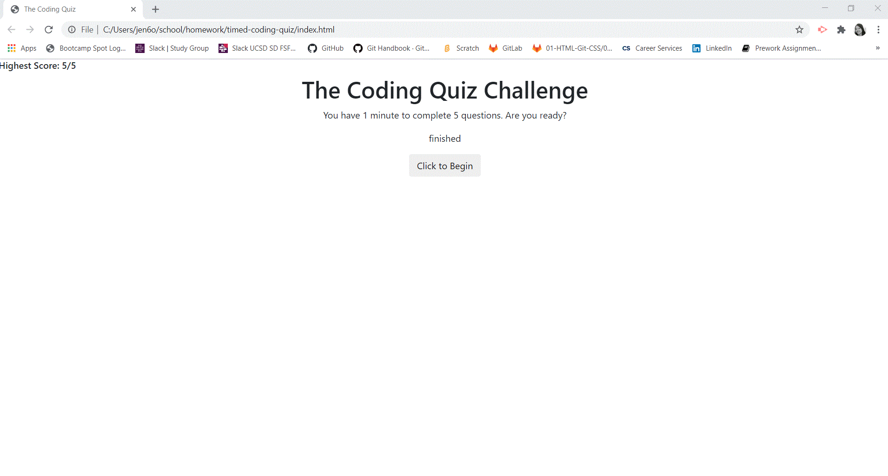

# timed-coding-quiz
This app is inteded to be a simple coding quiz designed to be completed within 60 seconds. It is comprised of five (5) multiple choice questions.  The app will run in the browser and incorporates HTML, JavaScript, CSS and Bootstrap. It also features a clean and simplistic user interface, which is responsive, ensuring that it can adapt to various screen sizes. 

## User Story
As a coding bootcamp student, I want to take a timed quiz on JavaScript fundamentals that stores high scores so that I can gauge my progress compared to my peers. 

# Preview

## Deployed Site Link
https://jen6one9.github.io/timed-coding-quiz/

## Acknowledgements
I would like to thank my tutor for her guidance and the support of my cohort peers on this incredible journey.

# License
Copyright 2020 Jeneth Diesta

Permission is hereby granted, free of charge, to any person obtaining a copy of this software and associated documentation files (the "Software"), to deal in the Software without restriction, including without limitation the rights to use, copy, modify, merge, publish, distribute, sublicense, and/or sell copies of the Software, and to permit persons to whom the Software is furnished to do so, subject to the following conditions:

The above copyright notice and this permission notice shall be included in all copies or substantial portions of the Software.

THE SOFTWARE IS PROVIDED "AS IS", WITHOUT WARRANTY OF ANY KIND, EXPRESS OR IMPLIED, INCLUDING BUT NOT LIMITED TO THE WARRANTIES OF MERCHANTABILITY, FITNESS FOR A PARTICULAR PURPOSE AND NONINFRINGEMENT. IN NO EVENT SHALL THE AUTHORS OR COPYRIGHT HOLDERS BE LIABLE FOR ANY CLAIM, DAMAGES OR OTHER LIABILITY, WHETHER IN AN ACTION OF CONTRACT, TORT OR OTHERWISE, ARISING FROM, OUT OF OR IN CONNECTION WITH THE SOFTWARE OR THE USE OR OTHER DEALINGS IN THE SOFTWARE. 